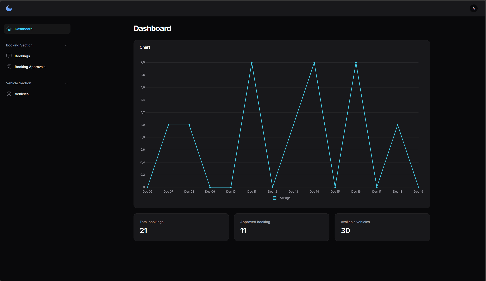
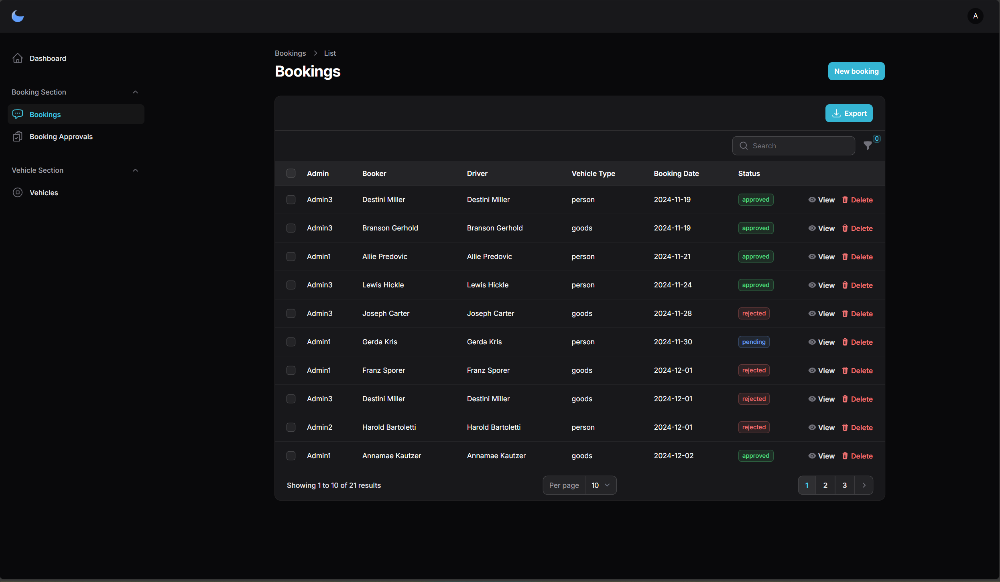
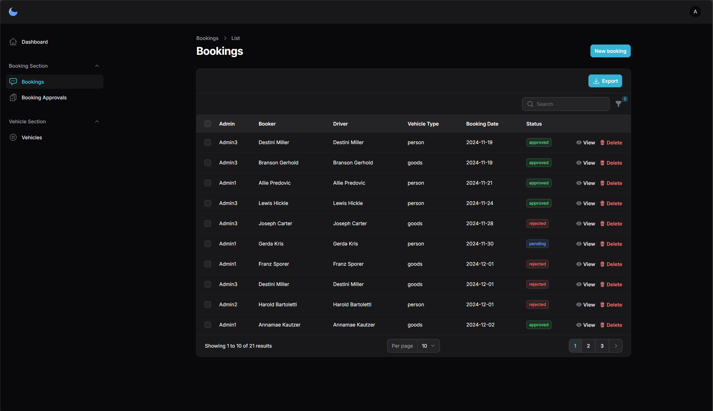

# Daftar Akun
## User di perusahaan pusat
1. Admin

    Username            : Admin1

    Password            : password123

2. Supervisor

    Username            : SupervisorCentral1

    Password            : password123

3. Head

    Username            : HeadCentral1

    Password            : password123

## User di perusahaan cabang
1. Admin

    Username            : Admin2

    Password            : password123

2. Supervisor

    Username            : SupervisorEast1

    Password            : password123

3. Head

    Username            : HeadEast1

    Password            : password123

# Version

mySQL       - 11.2.2-MariaDB
php         - 8.3.3
laravel     - 11
filament    - 3.x

# Lampiran

- [Physical Data Model](https://drive.google.com/file/d/1ffhQRHks46ukUoxwaC0lG1GvJLsq_2L0/view?usp=sharing)
- [Activity Diagram](https://drive.google.com/file/d/1ikQC15Z1PvFbQ3aDia67m7QrhzxktlEL/view?usp=sharing)

# User Manual

## Halaman Dashboard

Berisi:

### Keseluruhan
- Statistika Singkat:
    - Banyak booking pada tiap harinya dihitung dari sekarang ke 13 hari kebelakang
    - Total booking secara keseluruhan
    - Total booking yang disetujui secara keseluruhan 
    - Total kendaraan yang ada dengan status available

## Halaman Booking

### Admin
- Membuat, melihat, menghapus booking kendaraan sesuai dengan ketentuan
- Mengekspor laporan excel dari booking

## Halaman Vehicle

### Admin 
- Melakukan CRUD pada data kendaraan
- Melakukan CRUD vehicle_log serta maintenance schedule dari kendaraan dengan masuk ke salah satu kendaraan

# Panduan Penggunaan Aplikasi
## Login 
- Memasukkan username dan password yang sudah tertera diatas 
    
(posisi kantor dari user akan perpengaruh pada sebagian besar input serta tampilan yang ada)

2. Dashboard
- Melihat statistik singkat serta informasi data yang ada secara garis besar

## Kelola Booking

Admin:
1. Tambah Booking
    - Admin masuk ke halaman Booking
    - Admin memilih tombol "New Booking"
    - Admin memasukkan seluruh input yang ada pada form
    - Admin memilih opsi Create

2. Lihat Detail Booking
    - Admin masuk ke halaman Booking
    - Admin memilih opsi "view"
    - Detail Booking akan diperlihatkan

3. Menghapus Booking
    - Admin masuk ke halaman Booking
    - Admin memilih data mana yang akan dihapus
    - Admin memilih opsi "delete"

4. Mengekspor Excel
    - Admin masuk ke halaman Booking
    - Admin memilih opsi filter dan mengisi filter mana yang akan digunakan (opsional)
    - Admin memilih opsi "export" untuk mendapatkan file dalam bentuk excel

5. Melihat Status Approval per Level
    - Admin masuk ke halaman Booking Approvals

Approver:
1. Melakukan Approval untuk Booking
    - Approver masuk ke halaman Booking Approvals
    - Apabila status pada data pending, maka Approver bisa memilih opsi "Approved" dan "Rejected" untuk melanjutkan booking ke proses berikutnya.

(approval memiliki level yang fleksibel namun harus menunggu level sebelumnya untuk melakukan approve agar approval level selanjutnya ditampilkan pada menu ini)

## Kelola Vehicle
Admin:
1. Tambah Vehicle
    - Admin masuk ke halaman Vehicles
    - Admin memilih tombol "New Vehicle"
    - Admin memasukkan seluruh input yang ada pada form
    - Admin memilih opsi "Create"

2. Edit Vehicle
    - Admin masuk ke halaman Vehicles
    - Admin memilih tombol "Edit"
    - Admin memasukkan data baru pada seluruh atau sebagian input yang ada pada form
    - Admin memilih opsi "Save changes"

3. Melihat Detail Vehicle
    - Admin masuk ke halaman Booking
    - Admin memilih opsi "view"
    - Detail Booking akan diperlihatkan

4. Hapus Vehicle
    - Admin masuk ke halaman Booking
    - Admin memilih data mana yang akan dihapus
    - Admin memilih opsi "delete"

5. Melihat Vehicle Logs dan Vehicle Maintenance Schedule
    - Admin masuk ke halaman Vehicles
    - Admin memilih salah satu data yang ada pada table Vehicles
    - Admin diarahkan ke Edit Vehicle yang dibawahnya akan ada tabel tambahan berupa tabel Vehicle Logs dan Vehicle Maintenance Schedule
    - Admin dapat melakukan CRUD untuk kedua tabel tambahan ini sesuai dengan langkah-langkah CRUD sebelumnya.

